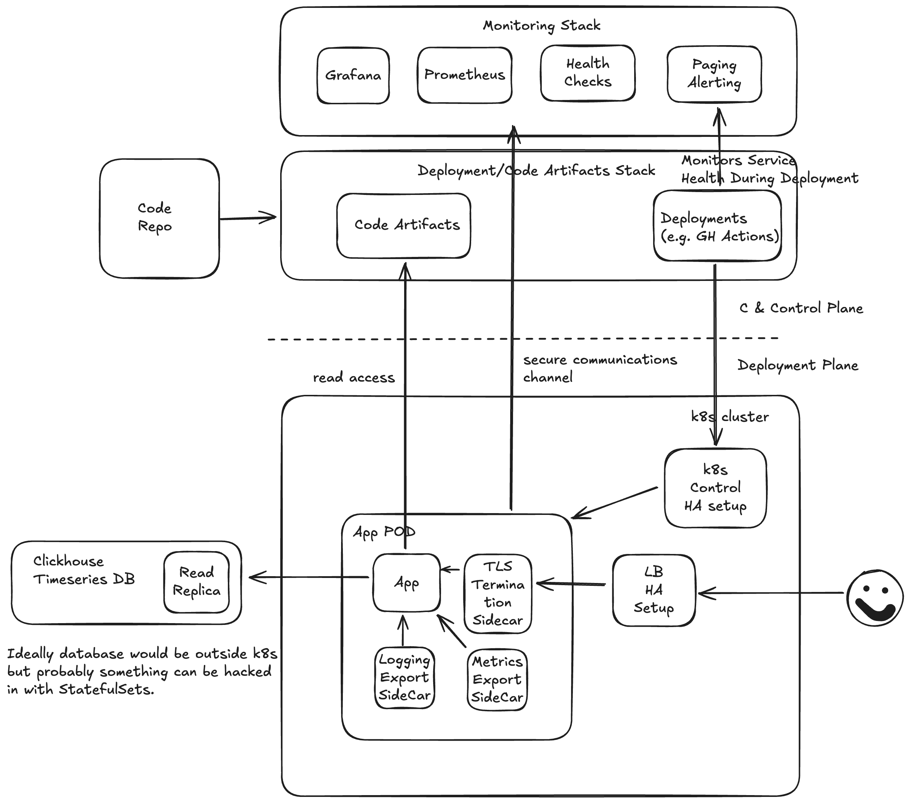

# Overview

Frankly, and ironically to the role, managed to spend least time on this. First time using `k8s` and decided to try it out with `minikube`.

Didin't go with AWS primitives as that would also lead to at best a toy example given the time constraints.

## Prerequisites

For the trial i've used [minikube](https://minikube.sigs.k8s.io/docs/start/?arch=%2Fmacos%2Farm64%2Fstable%2Fbinary+download) and [dockder](https://docs.docker.com/get-started/get-docker/)

As i'm not pushing this to [hub.docker.com](https://hub.docker.com/), we first need to build the package in `minikubes` personal docker daemon.

```
# this will load the image so that it can be deployed in local k8s cluster
eval $(minikube docker-env)
docker build -t joule:1.0 .
```

## Deployment

```
kubectl apply -f k8s/deployment.yaml
kubectl apply -f k8s/service.yaml
```

Above, of course, is nowhere near what someone would want for a production scenario, so i've drawn a component diagram to a potential set up for a multi tenant deployment.



For multi tenants, one of the main problems is to ensure isolation of the
resources accessed by each tenant.  In AWS for example, one of the setups we
could do is an AWS account per tenant/stage (this doesn't seem like a regionalized service). For k8s this could be done with a k8s cluster per customer/stage if the budget allows, allowing to outsource isolation to k8s and database offering of choice (e.g. Clickhouse). If it's too expensive, would search for a network isolation solution which would replicate all the components per tenant. As a last resort, and likely the most complicated set up would be to have app level isolation, where the application would deal with tenant boundaries. 

Bottleneck is most likely to be heavy analytical SQL queries required to service the requests. There are several ways around it:
- increase number of read replicas
- cache results
- enforce query limits to limit the processing time.


