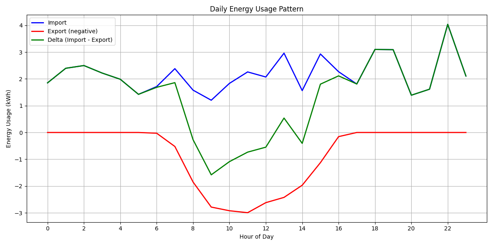
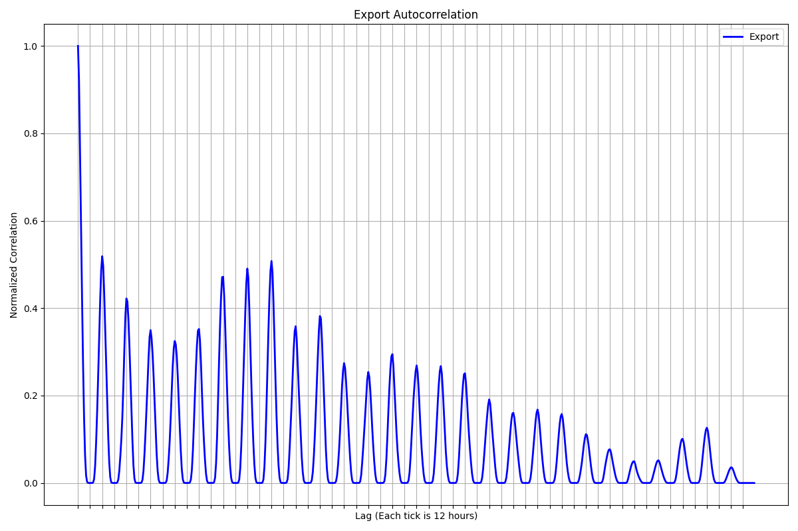
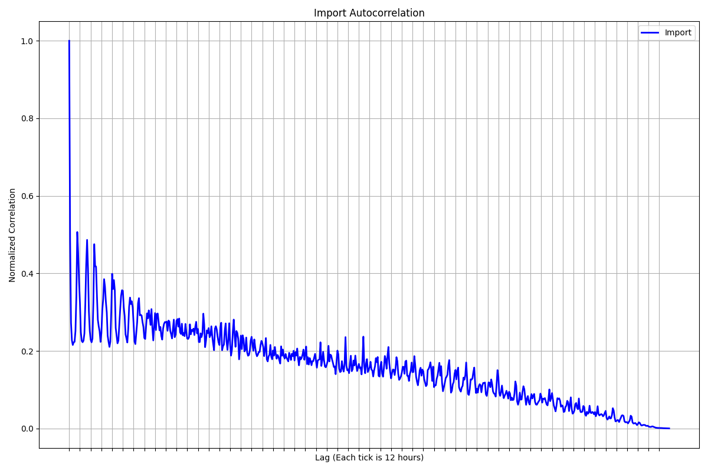
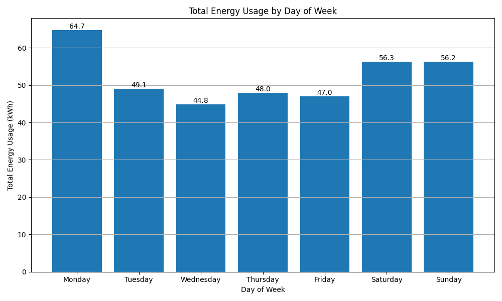

# Analysis

The given challenge seems to contain data from electricity measuring device. Given data contains two different measuring devices with different id's.

The devices export some kind of measurement, but it's obfuscated by a seemingly hex encoded parameter. After some initial research i've came to a conclusion that it most likely represent an [Object Identification System (OBIS) code](https://de.wikipedia.org/wiki/OBIS-Kennzahlen).

Looking through some obscure german and non-german documents [1](https://doc.smart-me.com/interfaces/auto-export) and [github repos](https://github.com/Shagrat2/obis2hex/blob/main/src/extension.ts) I was able to form a hypothesis that most likely this corresponds to:

- `0100011D00FF` - active energy imported
`1-?:1.29.0*255`: Active Energy Total Import

- `0100021D00FF` - active energy exported
`1-?:2.29.0*255`: Active Energy Total Export

I've made an assumption that kWh are the units as I think i've saw that mentioned somewhere 🤷.

# Patterns

First I've drawn daily energy usage pattern by hour of the day. This showed me that energy is exported strictly through what seems daytime hours in Germany (where the company mostly operates)

To dig deeper i've drawn auto correlation functions for both export and import energy respectively below:

For export, the tickes represent 12 hours, so we have cyclic correlations every 24 hours. This seems to hint at cycles related to sun, so my guess it's most likely energy measured from the solar panel. Wind energy would be more chaotic likely.

As for the import, there seems to be some cyclic behavior related to regular
human activities but I didn't dig deeper on what that may be. 

Lastly for the funsies I've drawn average energy used per day of week to understand whether we use more energy during the weekend (hypothesis that we stay more at home) or during weekdays (hypothesis that most people may be in the office). Didn't find anything entertaining on the surface.

